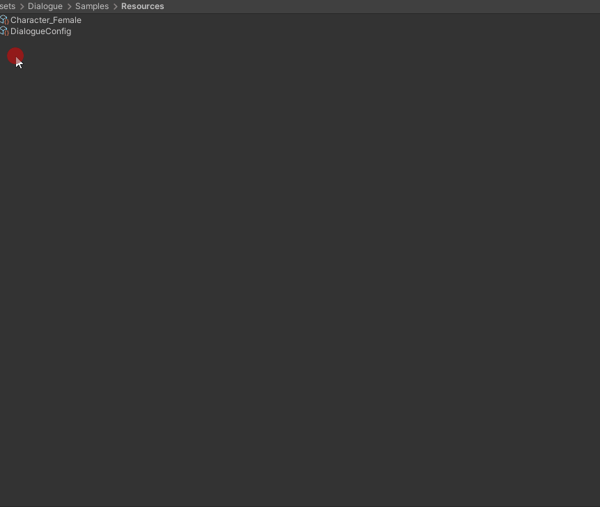

#Simple Dialogue solution from maleric
A Simple Dialogue Package with Dialogue solution. Solution support extension and creation of custom View, controller using different Initialize parameters.

#How to use it


## Setup Dialogue Settings Config
* Select Dialogue View Prefab (an UI) 
* Path to dialogues inside Resources (empty by default)
* Singleton options (disable if you have custom initialize logic)

## Create Characters
* Define Character Name
* Define expressions

## Create Dialogue
* Enter Dialogue lines and select character and it's expression
* Checkout option to disable skip
* Define position of character on screen
* If you have text file with character and dialogues, you can simply use Quick Add option
* If you're inside game, you can quickly test Dialogue by pressing Test Dialogue or Add To Queue

## Script Notes
Correct way to call dialogue is 
```
public class ShowDialogueOnStart : MonoBehaviour
{
	[SerializeField]
	private DialogueSequenceConfig startDialogue;

	private void Start()
	{
		if (startDialogue != null)
		{
			Dialogue.Instance.PlayImmediately(startDialogue);
		}
	}
}
```
The logic is build using MVC pattern with a lot of adjustable options.
You can create your own type of DialogueSequenceConfig by extending the
```
DialogueSequenceConfig<T> : DialogueSequenceConfig where T : IDialogueLine
```